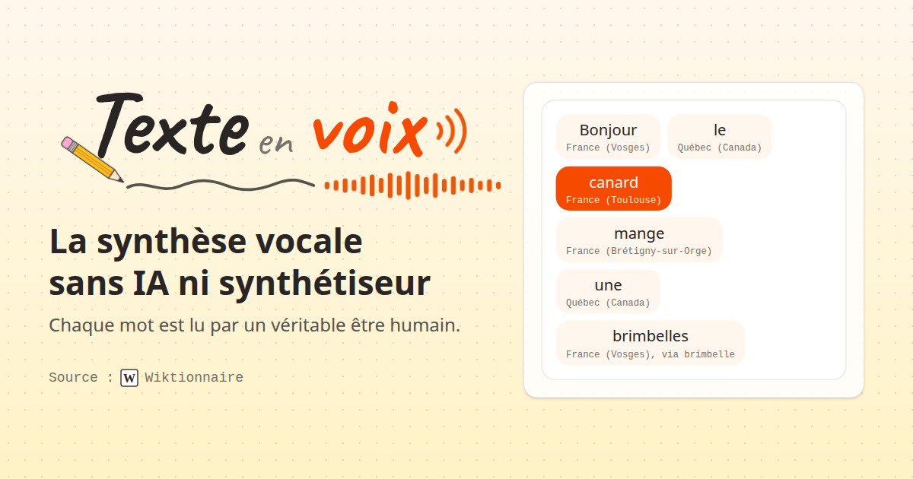
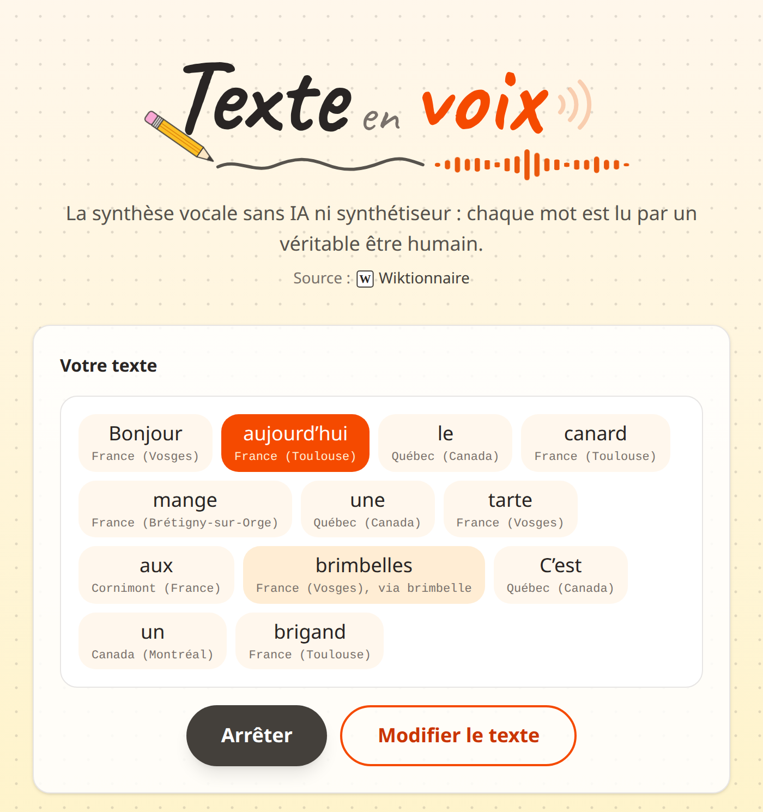

<div align="center">

[](https://texte-en-voix.yavadeus.dev)

# Texte en voix

**La synthèse vocale sans IA ni synthétiseur : tapez une phrase, chaque mot est lu
par un véritable être humain, grâce aux enregistrements du Wiktionnaire.**

[](./LICENSE)


### [▶ Essayer maintenant](https://texte-en-voix.yavadeus.dev)

</div>

---

## Le pitch

Les synthèses vocales modernes ont des réseaux de neurones, des milliards de
paramètres et des data centers. **Celle-ci a des Vosgiens.**

Vous tapez une phrase. Pour chaque mot, l'application va chercher sur le
[Wiktionnaire](https://fr.wiktionary.org/) un enregistrement fait par un humain,
choisit de préférence un accent **vosgien, québécois, suisse ou du Sud-Ouest**,
puis enchaîne les enregistrements. « Bonjour » est dit dans les Vosges, « le » au
Québec, « canard » à Toulouse. Le résultat est haché, imprévisible, et
étonnamment attachant.

> Si un seul mot n'a jamais été enregistré par personne, la phrase est refusée.
> Pas d'invention, pas d'approximation : que des vraies voix.

<div align="center">
  
</div>

## Fonctionnalités

- 🗣️ **De vraies voix** : chaque mot est un enregistrement humain du
  Wiktionnaire, la plupart venus de [Lingua Libre](https://lingualibre.org/).
- 🌍 **Des accents choisis** : vosgien, québécois, suisse et du Sud-Ouest en
  priorité, puis n'importe quel accent régional, et le « France » neutre en
  dernier recours.
- 🫐 **Les pluriels se débrouillent** : « brimbelles » n'a pas d'enregistrement ?
  Il emprunte celui de « brimbelle », mais seulement si les deux se prononcent
  exactement pareil.
- 🎙️ **Chaque voix est créditée** : le nom du locuteur dans sa bulle, sa
  licence au survol, comme le demandent les licences libres de Wikimédia.
- 🎚️ **Un montage soigné** : silences rognés, volumes égalisés, mots enchaînés,
  et le mot en cours mis en avant pendant la lecture.
- 🔗 **Chaque mot mène à sa page** du Wiktionnaire. Les mots introuvables aussi,
  avec une invitation à leur **prêter votre voix** sur Lingua Libre.
- ⏳ **Une attente assumée** : au moins 5 secondes de préparation, avec des
  messages de chargement parfaitement bidons (« On réveille le Vosgien… »).
- 🌗 **Mode sombre**, mobile, accessible au clavier et aux lecteurs d'écran.
- 💾 **100 % front-end** : aucun serveur, aucune donnée envoyée ailleurs qu'aux
  API publiques de Wikimédia.

## Comment ça marche

```
« Bonjour le canard »
  └─ découpage      mots, apostrophes typographiques (aujourd'hui -> aujourd’hui)
  └─ Wiktionnaire   1 requête pour toute la phrase (jusqu'à 50 mots)
  └─ {{écouter}}    les enregistrements français de chaque page, avec leur lieu
  └─ accent         Vosges, Québec, Suisse, Sud-Ouest > autre région > « France »
  └─ repli          pluriel sans voix -> mot de base, si la prononciation est identique
  └─ Commons        1 requête : adresse, auteur et licence de tous les fichiers
  └─ téléchargement un fichier à la fois, espacés de 100 ms
  └─ Web Audio      silences rognés, volume normalisé, mots enchaînés à 80 ms
```

### Deux ou trois choses qui n'étaient pas évidentes

- **Le Wiktionnaire est sensible à la casse.** « Paris » a sa page, « Bonjour »
  non : chaque mot est cherché tel quel, puis en minuscules.
- **Un pluriel n'est presque jamais enregistré**, alors que son singulier l'est.
  Le repli compare les prononciations écrites (`{{pron|mi.ʁa.bɛl|fr}}`) :
  « mirabelles » emprunte « mirabelle », mais « mangeons » n'empruntera jamais
  « manger ».
- **Le lieu du locuteur est du texte libre.** « France (Vosges) », « Vosges
  (France) », parfois même un commentaire HTML oublié (`France <!-- précisez svp
  la ville -->`). La détection des accents travaille sur des noms de lieux
  entiers : « Gers » ne se déclenche pas sur « Angers ».
- **Les 5 secondes d'attente ne sont pas un défaut.** Elles protègent Wikimédia
  (impossible de mitrailler les requêtes) et laissent le temps de télécharger les
  sons un par un, sans jamais les demander en parallèle. Relire une phrase déjà
  lue ne fait plus aucun appel réseau.
- **L'image de partage n'est pas une maquette.** Elle est rendue à partir des
  vrais composants du site, avec des mots et des lieux issus d'une vraie
  recherche.

## Démarrage

Prérequis : Node.js 22 ou 24 et `make`.

```sh
make install   # installe les dépendances
make start     # serveur de développement (http://localhost:9999)
make check     # build + lint + typecheck + knip + tests
make og        # régénère l'image de partage (nécessite google-chrome)
```

`make help` liste toutes les commandes. Le build (`dist/`) est **100 % statique**
et se déploie tel quel sur n'importe quel hébergeur de fichiers statiques.

Stack : React 19 · TypeScript strict · Vite · Tailwind CSS v4 · Web Audio API ·
Vitest + Testing Library. Les conventions et l'architecture sont détaillées dans
[AGENTS.md](./AGENTS.md).

## Limites connues

- **Les élisions** comme « l'arbre » ne sont pas encore découpées : si la forme
  élidée n'a pas sa propre page, la phrase est refusée.
- **Un pluriel sans prononciation écrite** sur sa page ne peut pas emprunter la
  voix de son singulier.
- **Lingua Libre ne permet pas de pré-remplir un mot** : le lien d'invitation
  ouvre l'assistant d'enregistrement, à vous d'y ajouter le mot.

## Licence

Code sous licence [MIT](./LICENSE). Les enregistrements audio restent la
propriété de leurs auteurs, sous leur licence respective (Wikimedia Commons).

---

<div align="center">
  <sub>
    Fait avec ❤️ par
    <a href="https://yavadeus.vercel.app"><b>YavaDeus</b></a>
  </sub>
</div>
